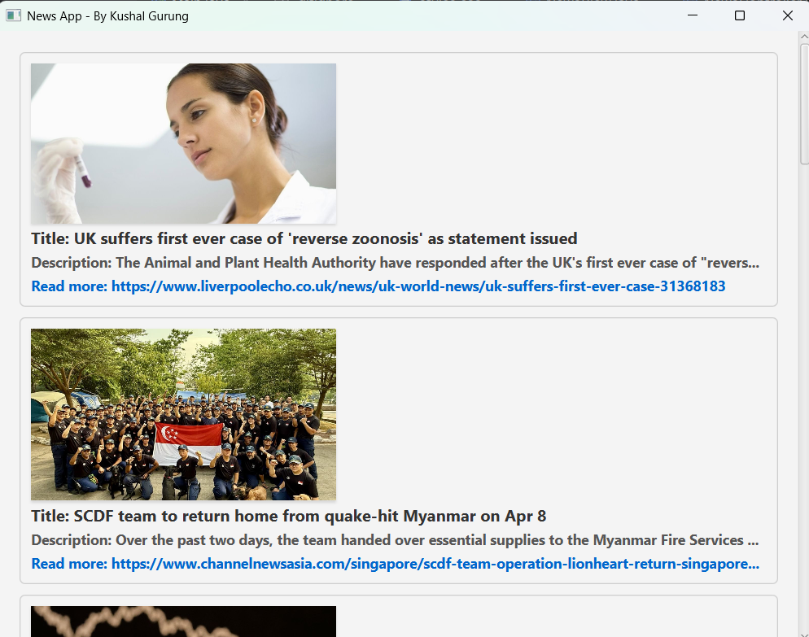

# Assignment2-Java3

---

# API= 1e417d82a32cef118105fb1a285d9404
Note: It's my free version API, do not use this one, please use your own API key, don't exploit this API key. :)

---

# 📰 JavaFX News App

A modern news feed application built using **JavaFX**, **OkHttp**, and **Gson**. It fetches real-time headlines from the [GNews API](https://gnews.io/) and displays them with images, titles, descriptions, and links to full articles.

---

## 📸 Demo

 

 


---

## 🚀 Features

- Fetches top headlines from GNews
- Displays news articles with images, titles, and descriptions
- Scroll to load more articles (infinite scrolling)
- Opens full articles in the browser
- Shows a loading animation while fetching more
- Language filter set to English only

---


## 🛠 Technologies Used

| Dependency | Description | Version |
|------------|-------------|---------|
| [JavaFX](https://openjfx.io/) | Used for building the graphical user interface (GUI) | 17 |
| [OkHttp](https://square.github.io/okhttp/) | HTTP client for making API requests | 4.11.0 |
| [Gson](https://github.com/google/gson) | JSON parser to handle API responses | 2.10.1 |

---

## 🔧 How to Run

### 1. Clone the Repository

```bash
git clone https://github.com/kushallegit/Assignment2-Java3.git
cd Assignment2-Java3
```
## 📥 2. Import into Your IDE

This is a standard Maven project. You can open it directly using File > Open in IntelliJ.


### 🛠️ 3. Set up JavaFX SDK

Make sure to configure JavaFX in your IDE and add the following VM options:

```bash
--module-path /path/to/javafx-sdk/lib --add-modules javafx.controls,javafx.fxml
```

## ▶️ 4. Build and Run

Run `Main.java` to launch the application.

---

## 📦 Project Structure


---

## 🔐 API Key

This app uses the [GNews API](https://gnews.io/).

My key is already included in `NewsService.java`:

```java
private static final String API_URL =
  "https://gnews.io/api/v4/top-headlines?lang=en&token=1e417d82a32cef118105fb1a285d9404";
```

Here, you can add your own API url and API key, I have used an API key which give live news and allows me 100 requests per and upto 10 articles returned per request, you can also get free API in the internet.

## 📸 API Request Limit

My API request limit is 100 requests per day, so if i make more than 100 requests in a day, it gives me this error :(

To avoid hitting the limit, consider caching data locally or upgrading your GNews plan.


---

## 📌 To Do

- [ ] Add topic filters (e.g., technology, sports)
- [ ] Add search functionality
- [ ] Show error pop-ups for API failures
- [ ] Paginate instead of infinite scroll

---

## 📄 License

This project is open-source and available under the [MIT License](LICENSE).

---

## 💬 Feedback

Got ideas or bugs? Feel free to [open an issue](../../issues) or submit a pull request. Contributions are welcome!


